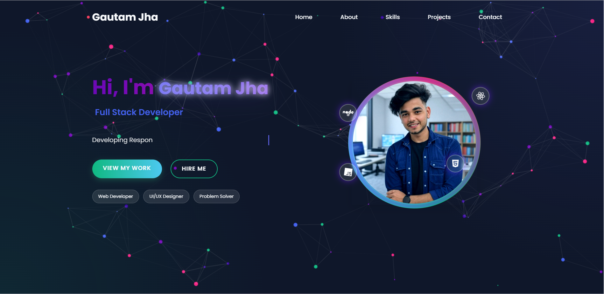
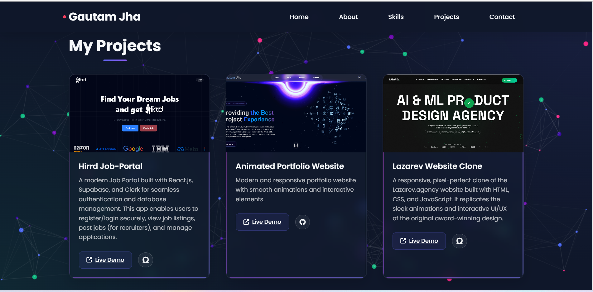
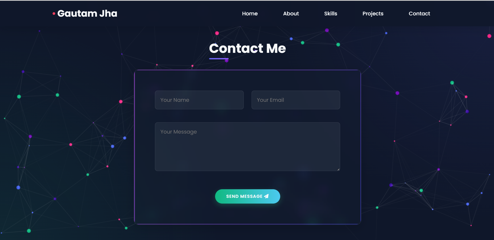

# ✨ Personal Portfolio Website 🌐

A sleek, modern **personal portfolio website** built with **HTML, CSS, and JavaScript**, featuring a **glassy (frosted-glass) UI** and **animated particle backgrounds**. Designed to showcase your projects, skills, and contact info in a stylish, interactive way.

---

## 📌 Features

- ✅ Responsive design for desktop, tablet, and mobile
- ✅ Frosted-glass (glassmorphism) UI effects
- ✅ Animated particles background using JavaScript
- ✅ Projects showcase section
- ✅ About / Skills section
- ✅ Contact form or contact links
- ✅ Smooth scrolling and subtle animations

---

## ⚙️ Tech Stack

- **HTML5** – Semantic markup
- **CSS3** – Styling with backdrop-filter/glass effects
- **JavaScript** – Interactivity and particle animations (e.g. particles.js or custom canvas)

---

## 🚀 Demo

[**Live Demo**](https://gautam-jha-portfolio-wp77.vercel.app/) *(Replace with your actual link)*

---

## 📸 Screenshots

| Home / Hero Section | Projects Section | Contact Section |
|----------------------|------------------|------------------|
|  |  |  |

*(Replace with your actual screenshots)*

---

## 🛠️ Installation

1️⃣ **Clone the repository**  
```bash
git clone https://github.com/Gautamjha321/Gautam-Jha-portfolio.git
cd Gautam-Jha-portfolio

2️⃣ Open in your code editor
Edit index.html, style.css, and script.js as needed to customize your content.

3️⃣ Run locally
Simply open index.html in your browser.

🌐 Deployment
Deploy easily using:

GitHub Pages

Vercel

Netlify

(Just drag and drop your files or connect the repo!)

🤝 Contributing
Pull requests are welcome! If you have ideas for improvements or new features, please open an issue first to discuss what you'd like to change.

📜 License
This project is licensed under the MIT License.
Feel free to use, modify, and share!